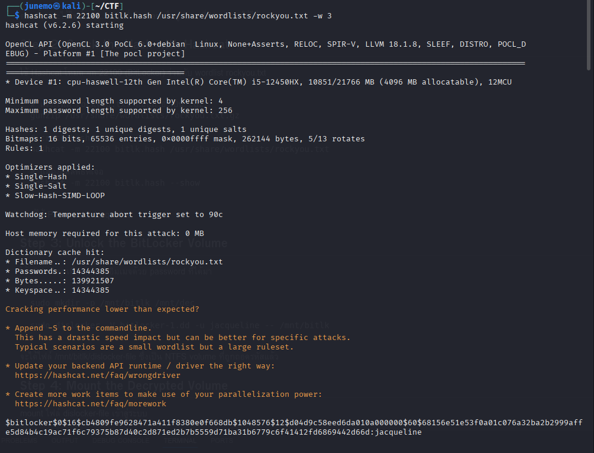

# CTF Writeup: BitLocker Forensics

## Description
เราได้รับดิสก์อิมเมจที่ถูกเข้ารหัสด้วย **BitLocker** (`bitlocker-1.dd`) โดยโจทย์บอกว่าผู้ใช้ตั้งรหัสผ่านง่าย ๆ  
งานเราคือการกู้รหัสผ่าน ถอดรหัส และหา flag

---

## Step 1: Extract the BitLocker Hash
ใช้ `bitlocker2john` เพื่อดึงค่า hash จากอิมเมจ

```bash
bitlocker2john -i bitlocker-1.dd > hash.txt
grep '\$bitlocker' hash.txt | head -n1 > bitlk.hash
```
ตอนนี้เราจะได้ไฟล์ bitlk.hash ที่เก็บ hash ในรูปแบบที่ Hashcat ใช้ได้

## Step 2: Crack the Hash with Hashcat
ใช้ Hashcat โหมด -m 22100 (BitLocker) ร่วมกับ wordlist rockyou.txt
```
# แตกไฟล์ rockyou.txt ก่อนถ้ายังเป็น .gz
gunzip /usr/share/wordlists/rockyou.txt.gz

# crack hash
hashcat -m 22100 bitlk.hash /usr/share/wordlists/rockyou.txt

# แสดงผลลัพธ์ที่เจอ
hashcat -m 22100 bitlk.hash --show
```
ผลที่ได้
Password = jacqueline




## Step 3: Unlock the BitLocker Volume
ใช้ dislocker เพื่อถอดรหัสอิมเมจด้วย password ที่ได้มา
```
sudo mkdir -p /mnt/bitlk /mnt/dec

sudo dislocker -V bitlocker-1.dd -u jacqueline -- /mnt/bitlk
```
จะได้ไฟล์ /mnt/bitlk/dislocker-file ซึ่งเป็น NTFS volume ที่ถูกถอดรหัสแล้ว

## Step 4: Mount the Decrypted Volume
mount ไฟล์ dislocker-file เข้าสู่ระบบ
```
sudo mount -o loop,ro /mnt/bitlk/dislocker-file /mnt/dec
ls -la /mnt/dec
```
## Step 5: Retrieve the Flag
ค้นหา flag ที่อยู่ใน filesystem
```
grep -r "picoCTF{" /mnt/dec 2>/dev/null
```