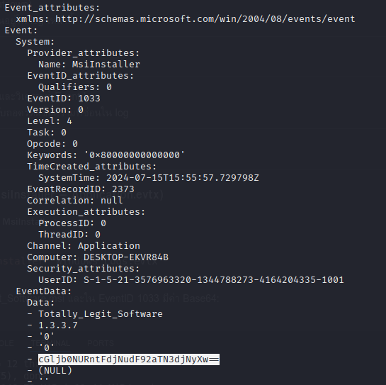
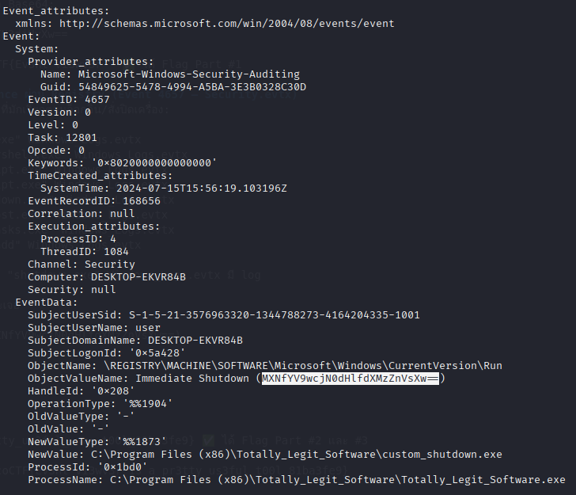
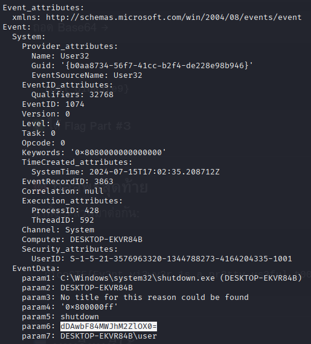

# picoCTF 2024 - Windows Logs Forensics

## 📌 คำอธิบาย (Description)
พนักงานคนหนึ่งได้ติดตั้งซอฟต์แวร์ที่ดาวน์โหลดมาจากอินเทอร์เน็ต หลังจากนั้น:
- เมื่อเปิดเครื่องและล็อกอิน จะมีหน้าต่าง Command Prompt โผล่มาแป๊บเดียว แล้วเครื่องก็ปิดตัวเองทันที  
- เราได้รับไฟล์ Windows Event Logs (`Windows_Logs.evtx`) มาเพื่อตรวจสอบ  
- เป้าหมายคือหาหลักฐาน 3 อย่าง:
  1. การติดตั้งซอฟต์แวร์  
  2. การรัน / การสร้าง persistence  
  3. การสั่งปิดเครื่อง (shutdown)  
- Flag ถูกแบ่งเป็น 3 ส่วนซ่อนอยู่ใน log เหล่านี้

---

## 🔎 เครื่องมือที่ใช้
- [Chainsaw](https://github.com/WithSecureLabs/chainsaw) → สำหรับค้นหาและวิเคราะห์ Event Log  
- Base64 Decoder → สำหรับถอดรหัสข้อความที่ซ่อนใน log  

---

## 📝 ขั้นตอนการทำ

### 1. การติดตั้งโปรแกรม (MsiInstaller – Application.evtx)
ค้นหาการติดตั้งโปรแกรมด้วยคำว่า **MsiInstaller**:

```bash
chainsaw search "MsiInstaller" Windows_Logs.evtx
```
จะพบค่า 
```
cGljb0NURntFdjNudF92aTN3djNyXw==
```


ซึ่งถอดรหัสจะได้เป็น picoCTF{Ev3nt_vi3wv3r_  ✅ ได้ Flag Part #1

### 2. การสร้าง Persistence ผ่าน Registry (Event 4657 – Security.evtx)
ลองหา process น่าสงสัยที่มักเรียกตอนล็อกอิน/สั่งปิดเครื่อง:

```
chainsaw search "cmd.exe" Windows_Logs.evtx
chainsaw search "powershell.exe" Windows_Logs.evtx
chainsaw search "wscript.exe" Windows_Logs.evtx
chainsaw search "cscript.exe" Windows_Logs.evtx
chainsaw search "shutdown.exe" Windows_Logs.evtx
chainsaw search "conhost.exe" Windows_Logs.evtx
chainsaw search "schtasks.exe" Windows_Logs.evtx
chainsaw search "reg add" Windows_Logs.evtx
```
พบว่าเจอ log ข้อความในส่วน shutdown.exe

ทำให้ได้เจอในส่วน 
```
Immediate Shutdown (MXNfYV9wcjN0dHlfdXMzZnVsXw==)
```



และ 

```
dDAwbF84MWJhM2ZlOX0=
```



ซึ่งถอดเป็น 1s_a_pr3tty_us3ful_ และ t00l_81ba3fe9} ✅ ได้ Flag Part #2 และ #3

เมื่อรวมกันจะได้ flag = picoCTF{Ev3nt_vi3wv3r_1s_a_pr3tty_us3ful_t00l_81ba3fe9}
