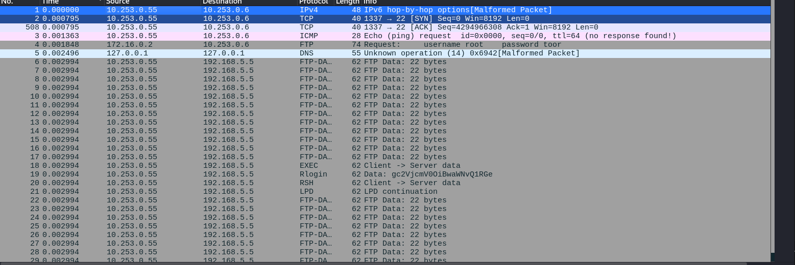
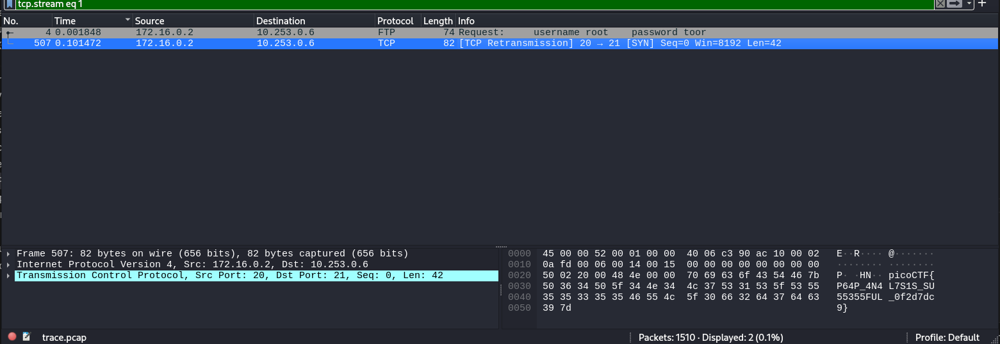

# CTF Writeup - Packet Capture Analysis

## 📌 Challenge
เราได้รับไฟล์ `trace.pcap` มาเพื่อหาค่า **flag** ที่ซ่อนอยู่ภายใน network traffic

---

## 🛠️ ขั้นตอนการแก้โจทย์

### 1. วิเคราะห์ไฟล์เบื้องต้น
เริ่มจากตรวจสอบว่าไฟล์ `.pcap` มีข้อมูลอะไรบ้าง  
บน Linux สามารถใช้คำสั่ง:
```bash
file trace.pcap
```


### 2.สังเกตุ trafic ที่ผิดปกติ
สังเกตุ trafic ที่ดูผิดปกติละลองกด follow ตามดูจะพบว่า


หรือจะลองใช้ strings ในการเช็คก่อนก็ได้
```
strings trace.pcap | grep -i "flag"
strings trace.pcap | grep -i "ctf"
```
