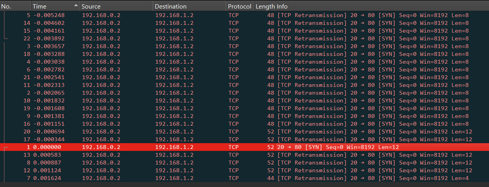
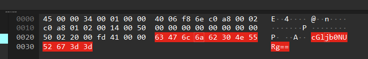
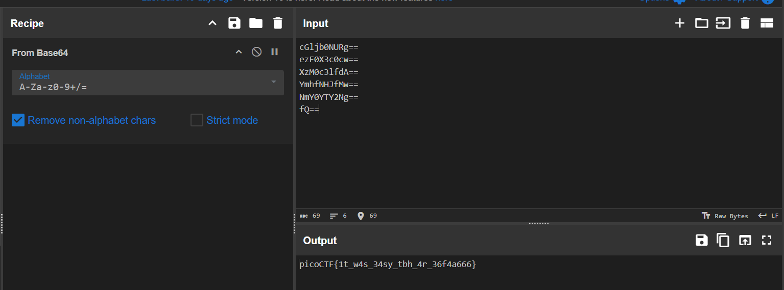

กดให้แพ็คเก็ทไฟล์เรียงตามเวลาก่อน

จากนั้นให้ดูข้อความด้านหลังที่ถูกเข้ารหัสด้วย base64

เราจะสังเกตเห็นว่ามันมี len 8 กับ 12 ซึ่งในที่นี้เราจะใช้ 12 
จากนั้นเริ่มก็อปค่าออกมาแล้วเอามา decode ที่ละบรรทัด

จะได้ flag เป็น picoCTF{1t_w4s_34sy_tbh_4r_36f4a666}