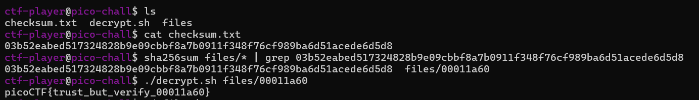

# CTF Writeup: Flag Verification with SHA-256 and Decrypt Script

## 🔎 หลักการของโจทย์
โจทย์นี้ถูกออกแบบมาเพื่อป้องกันผู้เล่นจากการถูกหลอกด้วย **ธงปลอม (imitation flags)**  
ผู้เล่นจะได้รับ:
- ค่า **SHA-256 checksum** ที่ถูกต้อง
- ไฟล์จำนวนมากในโฟลเดอร์ `files/`
- สคริปต์ `decrypt.sh` สำหรับถอดรหัส
- ไฟล์ `checksum.txt` เพื่อใช้ตรวจสอบ hash

หลักการคือ:
1. ใช้ SHA-256 ตรวจสอบว่าไฟล์ใดตรงกับ checksum ที่โจทย์ให้
2. เมื่อได้ไฟล์ที่ถูกต้องแล้ว ให้นำไปถอดรหัสด้วย `decrypt.sh`
3. ผลลัพธ์ที่ได้จะเป็น **flag จริง** ในรูปแบบ `picoCTF{...}`

---

## ⚙️ ขั้นตอนการทำ

### 1) ตรวจสอบ Checksum
```bash
cat checksum.txt
sha256sum files/* | grep 03b52eabed517324828b9e09cbbf8a7b0911f348f76cf989ba6d51acede6d5d8
./decrypt.sh files/00011a60
```

