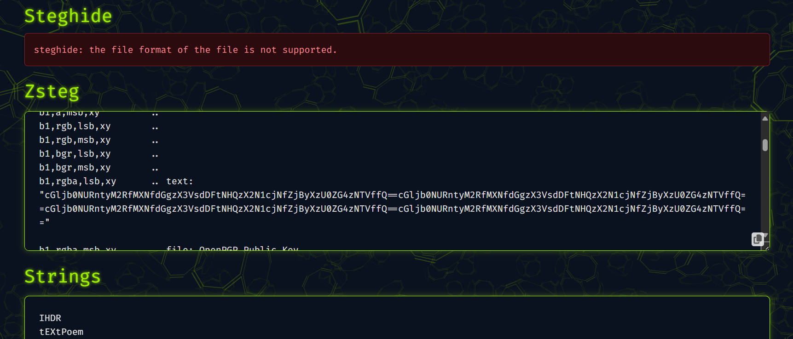
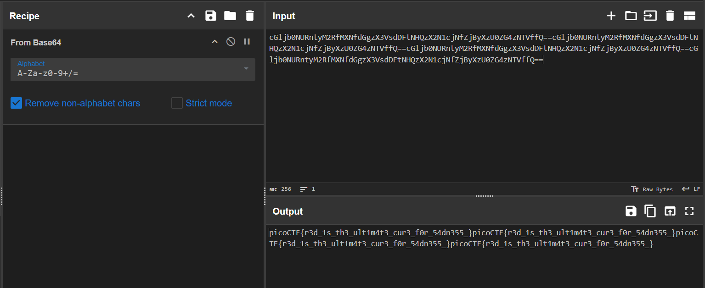

ใช้เว็บ https://www.aperisolve.com/fbe65d07ba29998b16639b8b586444f7 ในการหาข้อมูล

จะเจอข้อมูลในส่วนของ Zsteg นั้นคือ
cGljb0NURntyM2RfMXNfdGgzX3VsdDFtNHQzX2N1cjNfZjByXzU0ZG4zNTVffQ==cGljb0NURntyM2RfMXNfdGgzX3VsdDFtNHQzX2N1cjNfZjByXzU0ZG4zNTVffQ==cGljb0NURntyM2RfMXNfdGgzX3VsdDFtNHQzX2N1cjNfZjByXzU0ZG4zNTVffQ==cGljb0NURntyM2RfMXNfdGgzX3VsdDFtNHQzX2N1cjNfZjByXzU0ZG4zNTVffQ==

จากนั้นนำไปใส่ใน cyberchef จะได้ 

picoCTF{r3d_1s_th3_ult1m4t3_cur3_f0r_54dn355_} นั่นเอง